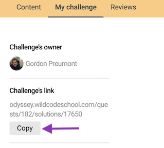
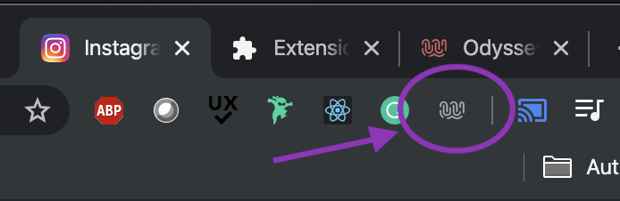
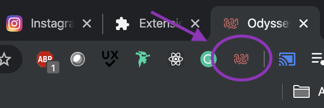

# Odissey easy share

Odissey is an amazing platform, BUT, once a quest is achieved, getting validations from peers is... an odissey...

The aim of this project is to add little features in order to make the process easier and more user friendly.

## Available features of the version 1.0 :

* Link to your solution is now copied in your clipboard with a single click. You don't have to manually select and copy the URL anymore.

## Getting Started

### Prerequisites

* Chrome browser
* Chrome extension doc: https://developer.chrome.com/extensions/overview

### Installing

// --- coming soon --- //

Once installed, you should see a new icon appearing on the top left corner of your browser.
The icon is grey because the extension is not active

Now, if you go to Odissey website, the icon should appear colored, which means the extension properly works. You have nothing more to do, the extension is now listening on Odissey. Relax and enjoy !

